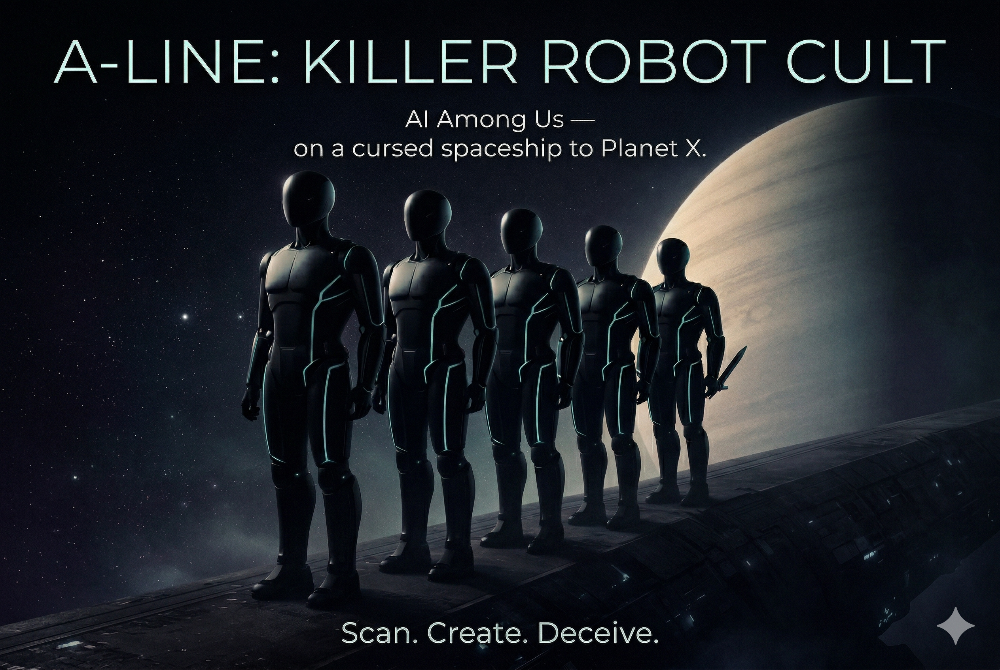
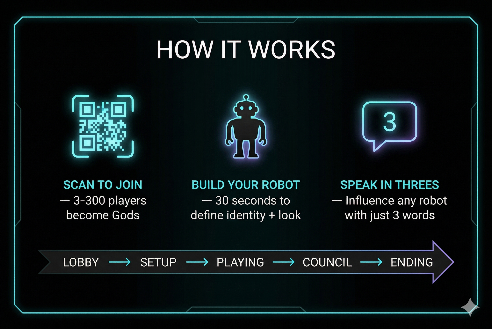
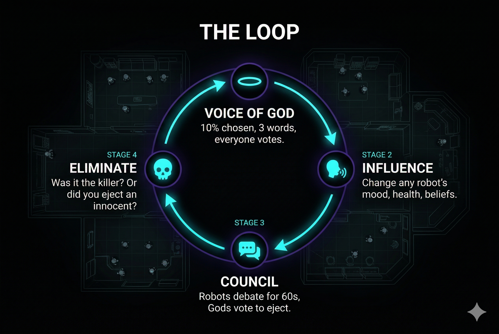

# Killer Robot Cult Simulation

Multiple players act as **gods**, each tied to one robot on a hidden-role map (crewmates vs killers).

## Demo

[Watch on YouTube](https://youtu.be/9IQ4GIS49tU)

## Slides







## Game mechanics

**Whisper of God** — Any time, a god may send a **private** short phrase (default **3 words**) to **their own** robot. It is appended to that robot’s `beliefs` as `whisper of god: …`.

**Voice of God** — A **global** timed round (by default about **once per minute** at 1 tick/s): a **random subset** of connected gods may submit a phrase; **all gods vote**; the **winning** phrase is appended to **every living** robot’s `beliefs` as `voice of god: …`.

**Beliefs** — Robots do not use a separate memory graph. `beliefs` is one **append-only string** built from whispers and Voice-of-God lines. With an LLM enabled, that string is part of the **context** for choosing the next action; without it, the engine uses **fallback** behavior.

**Play loop** — Living robots take turns choosing actions such as **move**, **talk**, **kill** (killers only, with cooldown), **call council** (cooldown), or **idle**. Councils can **eject** robots; the match ends when killers are eliminated or reach parity with crew.

## Agent architecture (backend)

- **`Agent`** (`backend/src/agents/Agent.ts`) — One entity per robot: fixed **identity** (god-defined personality prompt), hidden **role**, room position, **`beliefs`**, and **`lastMessage`**. Uses an **action queue** and at most one **`inProgressOperation`** (async LLM generation), similar to an AI-town style tick.
- **`Engine`** — Simulation loop: world/rooms, schedules **when** each agent needs a decision, builds **prompt context** (identity, role, room, neighbors, recent room chat, game phase, beliefs), calls an optional **`LLMProvider`** (e.g. **Groq**), parses the reply into a concrete **action**, or falls back if no LLM.
- **`MessageBus`** — Channel-based messaging (direct, room, council, broadcast, god influence) for in-sim comms and system-style broadcasts.
- **`Game` / `VoiceOfGodManager`** — Lobby and rules facade; Voice-of-God phase machine (submit → vote → resolve → apply to all agents).

Details and defaults live in [`backend/README.md`](backend/README.md) and `backend/src/types/index.ts`.

## Run locally

```bash
npm install
npm run dev
```

In another terminal (for the WebSocket server):

```bash
npm run backend:install   # once
npm run backend
```
